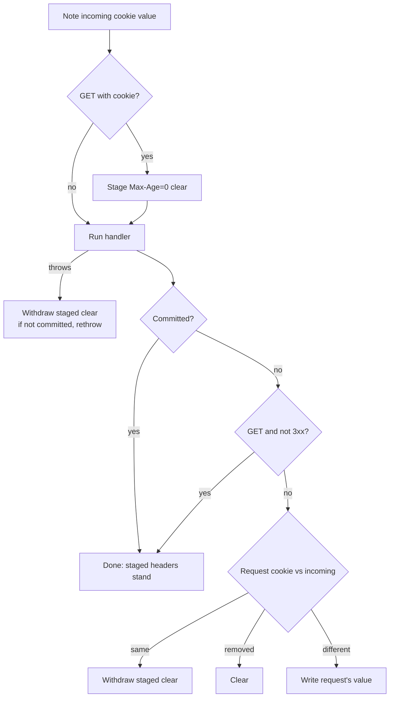

# Flash messages

## Motivation

A handler that processes a form usually redirects afterward (POST-redirect-GET). Any message it wants to show ("Settings saved") must outlive the redirect and reach the page that is finally rendered. Applications keep re-solving this with ad hoc cookies or query parameters.

This design adds a `Flash` wrapper for handlers and templates, plus a `FlashMessages` middleware that keeps the browser's flash cookie in step with the request.

## Public API

### `Flash` (in `org.lattejava.web`)

A thin wrapper around the request. It holds no state of its own: reading parses the request's `flash` cookie, and adding or clearing replaces that cookie on the request. Every `new Flash(req)` within a request therefore sees the same messages.

```java
public final class Flash {
  public static final String COOKIE_NAME = "flash";

  public Flash(HTTPRequest req);

  public Flash addMessage(String message);  // NullPointerException on null
  public Flash clear();
  public boolean hasMessages();
  public List<String> messages();           // unmodifiable, insertion order, empty if absent or unreadable
}
```

Handler:

```java
web.post("/settings", (req, res) -> {
  new Flash(req).addMessage("Settings saved");
  res.sendRedirect("/settings");
});
```

JTE template (`JTETemplates` always binds `request`):

```
@import org.lattejava.http.server.HTTPRequest
@import org.lattejava.web.Flash
@param HTTPRequest request
@for(String message : new Flash(request).messages())
  <div class="flash">${message}</div>
@endfor
```

### `FlashMessages` (in `org.lattejava.web.middleware`)

```java
public class FlashMessages implements Middleware {
  public FlashMessages();
}
```

Install globally or under a prefix like any other middleware. Without it, `Flash` still reads and updates the request's cookie, but nothing reaches the browser.

## How the two cooperate

The middleware never parses the cookie. It records the value the browser sent, runs the handler, and compares the request's cookie afterward:



- `Flash.addMessage` parses the request's cookie, appends, re-encodes, and calls `HTTPRequest.addCookies`, which replaces the cookie by name. `Flash.clear` calls `HTTPRequest.deleteCookie`.
- After the handler, a changed request cookie is written to the response with the `Cookies` defaults plus `SameSite=Lax`; a removed one is cleared; an unchanged one produces no `Set-Cookie` header.
- Cookie headers must be in place before the response is committed, and a rendering handler commits the response while writing the body. The clear for a GET is therefore staged before the handler runs. `HTTPResponse.addCookie` keys cookies by path and name, so a later write replaces the staged clear, and `removeCookie` withdraws it.

## Lifecycle

| Request outcome                                  | Effect on the browser's flash cookie                          |
|--------------------------------------------------|---------------------------------------------------------------|
| GET, final status not 3xx                        | Consumed: cleared. Messages added during this GET are dropped |
| GET, final status 3xx                            | Carried forward                                               |
| Any other method, any status                     | Carried forward                                               |
| Handler throws                                   | Left exactly as the browser sent it                           |
| Response committed before the handler returned   | Whatever was staged stands (see below)                        |

"Carried forward" writes the cookie only when the handler added or removed messages.

Messages added during a request are visible to the rest of that request through the request's cookie, so a template rendered in the same request shows them. Whether they also reach the browser depends on the response:

- A consuming GET never writes additions; the staged clear (if any) went out with the page. A message is thus never displayed twice.
- A redirect or a non-GET response that has not been committed writes them.
- A non-GET response that was committed by writing a body keeps whatever the browser already had, because the headers are gone. Add messages before redirecting to carry them to the next page.

## Cookie

| Attribute  | Value                                                        |
|------------|--------------------------------------------------------------|
| Name       | `flash`                                                      |
| Value      | `{"messages":["...", "..."]}` as unpadded Base64URL of UTF-8 |
| `HttpOnly` | `true`                                                       |
| `SameSite` | `Lax`                                                        |
| `Path`     | `/`                                                          |
| `Secure`   | Auto-detected by `Cookies`                                   |
| `Max-Age`  | Unset (browser session)                                      |

- The value is not encrypted or signed. Flash messages are display text that the browser already gets to see, and a browser that edits its own cookie only changes what it is shown. Templates must escape messages like any other user-supplied text; JTE does this by default. Base64URL is used because the `Cookie` class writes values verbatim and JSON contains characters that are not cookie-safe.
- Because the value is user-editable, `Flash.messages()` is defensive: a value that fails Base64URL decoding, is not a JSON object, or has a non-string element in `messages` (a number, boolean, nested object, or nested array) reads as no messages. Explicit `null` elements are dropped. An unreadable cookie is cleared by the next consuming GET like any other and replaced by the next `addMessage`.
- `SameSite=Lax` rather than the `Cookies` default of `Strict` so the cookie is sent on the top-level GET that ends a redirect chain started at another site (for example, returning from an OIDC provider). The cookie is only read on GETs, so `Lax` gives up nothing.
- The JSON is an object rather than a bare array so fields can be added later without invalidating cookies already in browsers. The shape is the `@JSON` record `org.lattejava.web.internal.FlashCookie`.

## Error model

| Condition                                        | Result                                                            |
|--------------------------------------------------|-------------------------------------------------------------------|
| `new Flash(null)` or `addMessage(null)`          | `NullPointerException`                                            |
| `messages().add(...)`                            | `UnsupportedOperationException`                                   |
| Unreadable cookie                                | Logged at `DEBUG` by `Flash`, reads as no messages                |
| `Flash` used without the middleware              | Reads and same-request updates work; nothing reaches the browser  |

## Testing

`src/test/java/org/lattejava/web/tests/middleware/FlashMessagesTest.java` drives a real server through `WebTest`, whose cookie jar carries the cookie across hops. It covers: single and multiple redirects, accumulation across hops, non-GET requests not consuming, a GET that adds and renders in one request, a GET that adds without rendering, an uncommitted GET, 302/303/307, `clear()`, hand-crafted cookies (readable, non-string elements, null elements, invalid Base64URL and JSON, unreadable values on GET and non-GET), a throwing handler under `ExceptionHandler`, cookie attributes and wire format, `Flash` without the middleware, and JTE rendering with HTML escaping via `src/test/jte/flash.jte`.

## Out of scope

- Encryption or signing. Not required for display-only text; see the Cookie section.
- A configurable cookie name. One application per origin is the expected deployment; the name is a constant.
- Typed or keyed messages (info/error). Messages are plain strings; a category can be encoded in the string by convention.
- Automatic `flash` binding in `JTETemplates`. Templates use `new Flash(request)`, which keeps `JTETemplates` independent of the middleware.
- A size cap. Browsers limit a cookie to roughly 4 KB; applications are expected to queue a few short messages.
