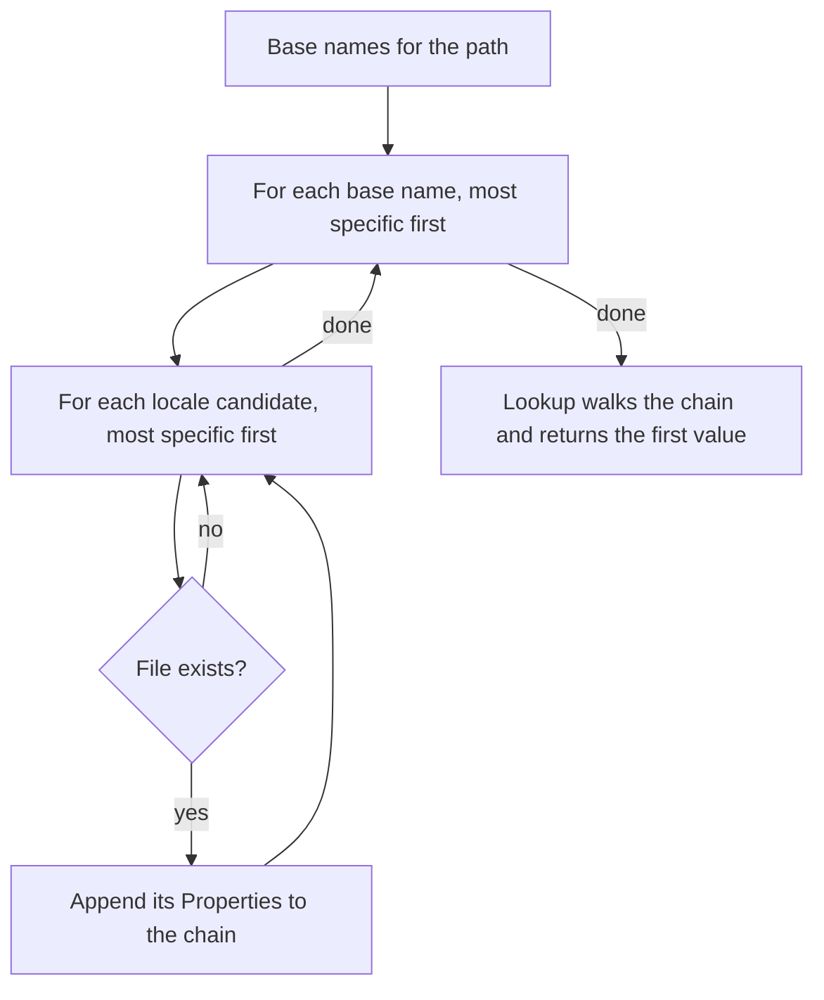

# Messages

## Motivation

Pages need display text that is easy to translate and easy to find. Keeping every string in one bundle scales badly; scattering bundles by class ties text to code layout. This design adds a `Messages` helper that reads properties files laid out like the URL space, so the text for a page sits next to the text for its section and its site.

## Public API

### `Messages` (in `org.lattejava.web`)

A thin wrapper around the request, in the same style as `Flash`. It can be created wherever the request is available: handlers, middleware, and templates.

```java
public final class Messages {
  public static final String DIRECTORY = "web/messages";

  public Messages(HTTPRequest req);                                // locale from req.getLocale()
  public Messages(HTTPRequest req, Locale locale);                 // explicit locale
  public Messages(Path baseDir, String path);                      // no request; Locale.getDefault()
  public Messages(Path baseDir, String path, Locale locale);       // no request; explicit locale

  public String find(String key, Object... args);   // null when undefined
  public String get(String key, Object... args);    // MissingMessageException when undefined
  public boolean has(String key);
  public Locale locale();
}
```

Handler:

```java
web.get("/admin/users/edit", (req, res) -> {
  Messages messages = new Messages(req);
  String title = messages.get("title");
  String saved = messages.get("saved", user.name());
  ...
});
```

JTE template (`JTETemplates` always binds `request`):

```
@import org.lattejava.http.server.HTTPRequest
@import org.lattejava.web.Messages
@param HTTPRequest request
<h1>${new Messages(request).get("title")}</h1>
```

Without a request, for tests driving a server through `WebTest`. The base directory is the value passed to `Web.baseDir(Path)`, so the expected text comes from the same files the server reads and follows the same lookup rules. The two-argument form uses `Locale.getDefault()`, which is what the server uses for a request without `Accept-Language`:

```java
Messages messages = new Messages(PROJECT_DIR, "/admin/users/edit", Locale.GERMAN);
new WebTest(PORT).withHeader("Accept-Language", "de")
                 .get("/admin/users/edit")
                 .assertBodyAs(new StringBodyAsserter(), s -> s.contains(messages.get("title")));
```

These constructors build their own `MessageStore` rather than sharing the server's, so each instance reads its files afresh. That is a handful of small files and keeps the lookup independent of any running server.

### `MissingMessageException` (in `org.lattejava.web`)

Thrown by `get` when no file in the chain defines the key. It extends `RuntimeException`, not `HTTPException`, so the default error renderer does not write the key and path to the client. `key()` returns the key.

## Files

| Item      | Value                                                                            |
|-----------|----------------------------------------------------------------------------------|
| Location  | `<baseDir>/web/messages`, where `baseDir` is set by `Web.baseDir(Path)`          |
| Format    | `java.util.Properties` text format                                               |
| Encoding  | UTF-8                                                                            |
| Naming    | `<base>.properties`, `<base>_<lang>.properties`, `<base>_<lang>_<COUNTRY>.properties`, following `ResourceBundle` |

## Lookup

Two axes are combined: the path hierarchy (primary) and the locale chain (secondary).

### Path hierarchy

A request path names a leaf file, and every directory above it contributes an `index`. A path ending in a slash is itself a directory: it has no leaf file and starts at that directory's index. `/users` and `/users/` are therefore different pages, in the same way that `JTETemplates` maps them to `users.jte` and `users/index.jte`.

| Request path        | Base names, most specific first                                  |
|---------------------|-----------------------------------------------------------------|
| `/`                 | `index`                                                         |
| `/users`            | `users`, `index`                                                |
| `/users/`           | `users/index`, `index`                                          |
| `/admin/users/edit` | `admin/users/edit`, `admin/users/index`, `admin/index`, `index` |

### Locale chain

Each base name expands to the `ResourceBundle.Control` candidate list for the locale. For `de_DE` that is `_de_DE`, `_de`, then no suffix. The locale is `HTTPRequest.getLocale()` (the highest-weighted `Accept-Language` value, or the JVM default when the header is absent) unless one is passed to the constructor. Only the preferred locale is used; lower-weighted `Accept-Language` entries are not tried.

### Order



Every locale variant of one base name is consulted before moving to the next base name. For `/admin/users/edit` in `de_DE`, `admin/users/edit.properties` therefore beats `admin/index_de.properties`: a message written for the page wins over a translation written for the site.

### Formatting

| Call                     | Result                                                                  |
|--------------------------|-------------------------------------------------------------------------|
| `get("k")`               | The raw value. Apostrophes and braces are literal.                      |
| `get("k", a, b)`         | `new MessageFormat(value, locale).format(args)`                         |
| Value is `k=` (empty)    | Defined; returns `""`                                                   |

## Caching

`org.lattejava.web.internal.MessageStore` holds one `ConcurrentHashMap` from relative file name to an entry of `Properties` plus the file's last-modified time and size at the time it was read. Each file is read on first use. Every lookup reads the file's attributes with one `Files.readAttributes` call and compares them to the cached entry; when they differ the file is read again and the entry replaced, so an edit, a new file, or a deleted file takes effect on the next request without a restart. A missing file is remembered as missing until it appears. Size is compared as well as time because some file systems keep last-modified time at one-second resolution. The store lives in `HTTPContext` attributes under the key `org.lattejava.web.Messages`, created on first use with `computeIfAbsent` (the attribute map is synchronized). A new `Web` has a new context and therefore a new cache.

`Messages` resolves its chain of `Properties` in the constructor. That is a handful of string operations and map hits, so creating one per lookup in a template is fine.

## Error model

| Condition                                          | Result                                                        |
|----------------------------------------------------|---------------------------------------------------------------|
| `new Messages(null)` or a null locale or key       | `NullPointerException`                                        |
| Request without an `HTTPContext`                   | `IllegalStateException`                                       |
| `get` on an undefined key                          | `MissingMessageException` naming the key, path, and locale    |
| `find` on an undefined key                         | `null`                                                        |
| Path segment resolves outside the messages directory | The file is treated as missing                              |
| Messages directory does not exist                  | Every key is undefined                                        |
| File exists but cannot be read                     | `UncheckedIOException`                                        |

## Testing

`src/test/java/org/lattejava/web/tests/MessagesTest.java` drives a real server whose base directory is `src/test/projects/message-bundles`, a small project holding `web/messages/**.properties` and `web/templates/messages.jte`. It covers: the path hierarchy including the difference between `/admin` and `/admin/` and a leaf named `index`, the locale chain at each level and the precedence between levels, `Accept-Language` weights, an explicit locale, `MessageFormat` arguments with locale-sensitive number formatting, verbatim values without arguments, UTF-8, empty values, `find`, `has`, `get` throwing, a path that tries to escape the directory (`web/secret.properties`), a missing directory, reloading after a file is edited, deleted, and recreated, the request-free constructors agreeing with the server's answer, middleware access, and JTE rendering with HTML escaping.

## Out of scope

- A configurable directory. The layout is fixed at `web/messages` under the base directory, matching `web/templates` for JTE.
- Trying lower-weighted `Accept-Language` locales when the preferred one has no translation. The root file is the fallback.
- Pluralization beyond what `MessageFormat` provides.
